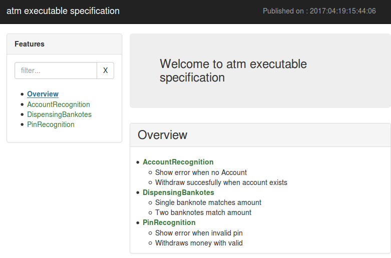
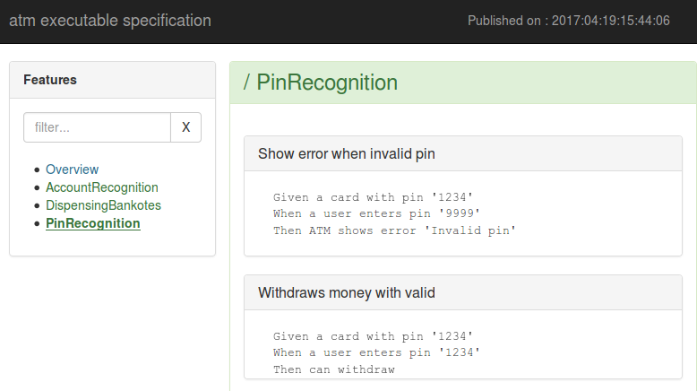

# gherkin-htmlify

Generate html pages from your feature files and share them easier.

## examples of generated pages

- Overview:

- Feature:

## how to run gherkin-htmlify

Checkout the gherkin-htmlify project to generate html pages
  
    git clone https://github.com/sboursault/gherkin-htmlify.git
    cd gherkin-htmlify
    npm install gherkin-htmlify
    node runner.js

You'll see sample output in 
  
	./gherkin-htmlify/test/output dir

## how to use your project's gherking files  

Modify runner.js to use your input and output dirs. 
    
   